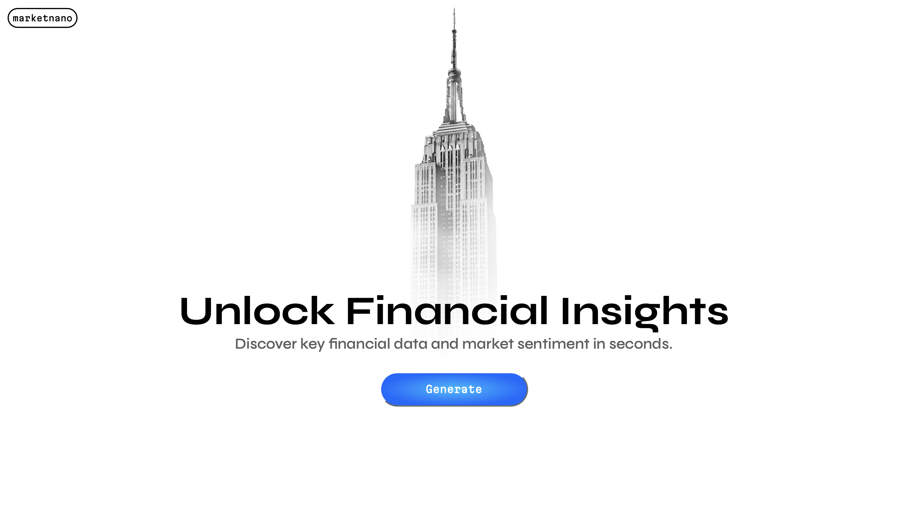

# MarketNano 🚀

Welcome to MarketNano, your passport to the world of financial exploration and discovery! 🌍

## About MarketNano

MarketNano is not just another financial website; it's your **rocket** to the financial universe! 🚀 We're your trusted source for:

- 📈 **Real-Time Data**: Stay updated with the latest financial information for any publicly traded stock.

- 💡 **Smart Decisions**: Analyze earnings, P/E ratios, and dividend yields to make informed investments.

- 📰 **Latest News**: Get the pulse of the market with the latest news and sentiment analysis.

## Features 🌟

- **Responsive Design**: Our platform adapts to any device, ensuring a seamless experience on your desktop, tablet, or smartphone.

- **Free Access**: Enjoy our basic service for free, or elevate your experience with our premium plans.

- **Live Updates**: Financial data is updated in real-time, giving you the edge in decision-making.

## Getting Started 🚀

To embark on your financial journey with MarketNano, follow these steps:

1. Clone this repository to your local machine:

   ```bash
   git clone https://github.com/your-username/marketnano-website.git

2. Launch the project in your favorite code editor.

3. Customize the website to reflect your branding and content by modifying HTML, CSS, and JavaScript files.

4. Deploy the website to your preferred hosting platform.

## Contributing 🤝

Ready to contribute to MarketNano's mission? We welcome contributions from the community! To get started, please follow these guidelines:

- Read our [contributing guidelines](CONTRIBUTING.md) for a detailed overview of the contribution process.

- Fork this repository and create a new branch for your feature or bug fix.

- Make your changes, test them thoroughly, and ensure they adhere to our coding standards.

- Submit a pull request, and our team will review your changes. We appreciate your help in making MarketNano better!

## Contact 📧

Have questions or feedback? We'd love to hear from you! You can reach out to us at contact@marketnano.com, and our team will get back to you as soon as possible.

## License 📜

This project is licensed under the GNU General Public License, Version 3 (GNU GPLv3). You are free to use, modify, and distribute this project in accordance with the terms and conditions of the GNU GPLv3. Please review the [LICENSE](LICENSE) file for the full text of the license.

Thank you for choosing MarketNano for your financial exploration journey! 🚀